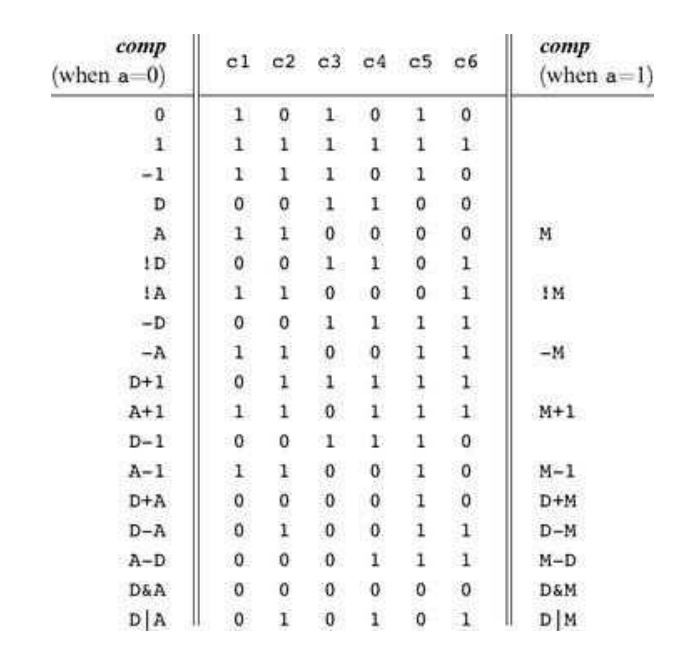
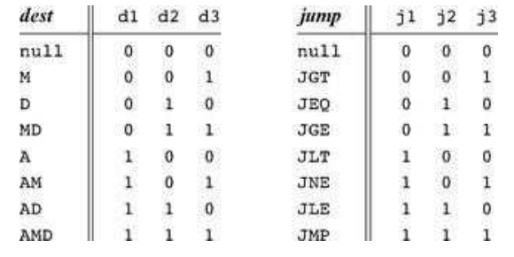
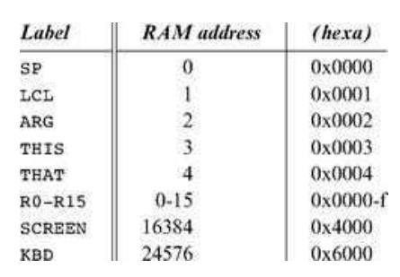
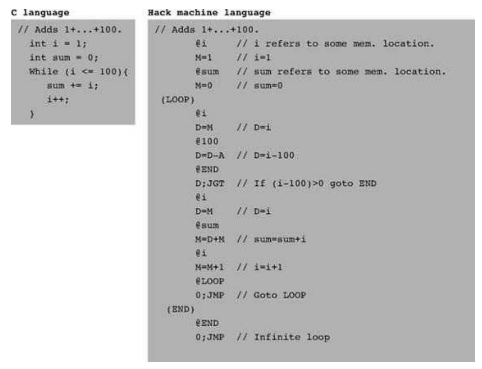
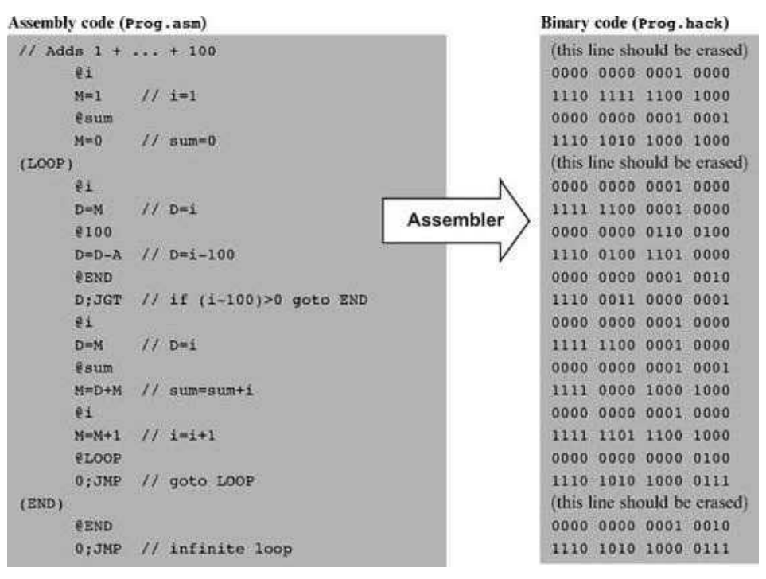

# File Formats

 - All assembly source files should be in a text file named `*.asm`
 - All translated machine code will be output as `*.hack`
 - Each line in the `*.hack` file is a sequence of 16 0 or 1 ASCII characters, coding a single 16-bit machine language instruction

# Translation Rules

## Constants and Symbols

Constants must be non-negative and are written in decimal notation. A userdefined symbol can be any sequence of letters, digits, underscore (_), dot (.), dollar sign ($), and colon (:)
that does not begin with a digit.


## Comments

Text beginning with two slashes (//) and ending at the end of the line is considered a comment
and is ignored.

## White Space

Space characters are ignored. Empty lines are ignored.

## Case Conventions

All the assembly mnemonics must be written in uppercase. The rest (user-defined
labels and variable names) is case sensitive. The convention is to use uppercase for labels and lowercase
for variable names.

# Registers

### A-register

A-register is a general purpose register to store information. It's the only place we can store constants.

### D-register

D-register is like A-register but it can't accept constants from us. It can only store result of operations.

### M-register

M-register is like a pseudo register that's a dereference of the A-register.

In high level
```
D = Memory[800] - 1
```
Becomes
```
@800
D = M-1
```

# Instructions

### A-Instruction

```
@value
```
Store value in the A-register, Where value is a non-negative decimal number or symbol referring to the number.

Translates to:
```
0XXXXXXXXXXXXXXX
```
Where XXXXX forms the 15bit number.

### C-Instruction

```
dest=comp;jump
```
Either dest or jump may be empty.

If dest is empty, `=` is omitted.

If jump is empty, `;` is omitted.

Translates to:
```
111ACCCCCCDDDJJJ
```

Following this table:



# Symbols

### Predefined Symbols



### Labels

The pseudo-command (Xxx) defines the symbol Xxx to refer to the instruction memory location holding the next command in the program.

```
(LOOP)
```

Each of such a label can be defined only once and can be used
anywhere in the assembly program, even before the line in which it is defined.

We also refer to it as a `L-Instruction`.

### Variables

Any symbol Xxx appearing in an assembly program that is not predefined and is not
defined elsewhere using the (Xxx) command is treated as a variable.

```
@test
```

Variables are mapped to
consecutive memory locations as they are first encountered, starting at RAM address 16 (0x0010).

# Finally

Example asm code:


Exampl translation:
